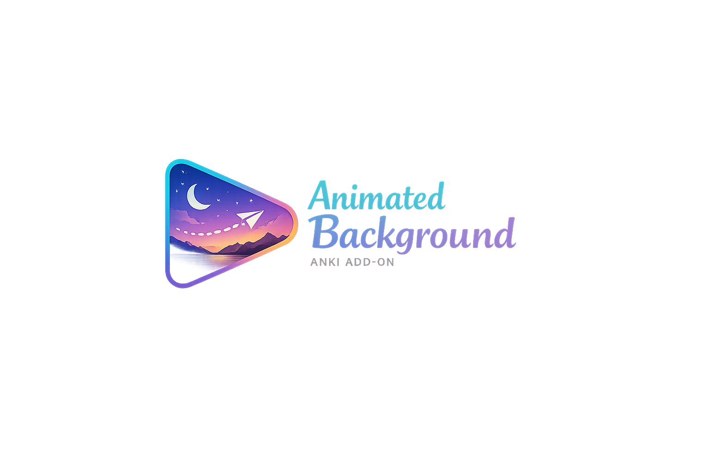
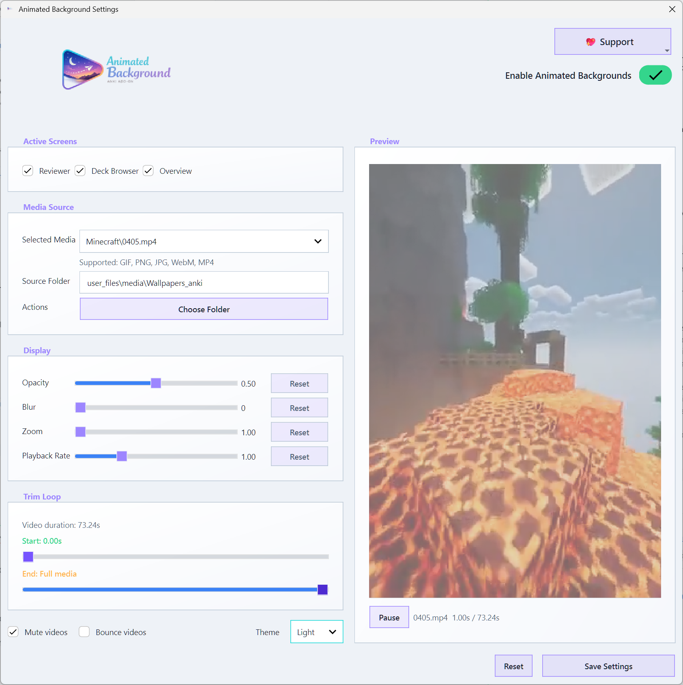
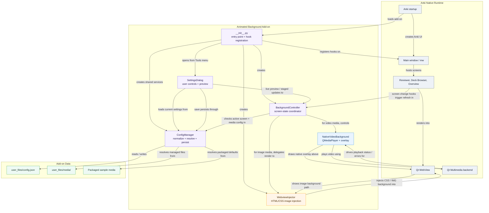

# AnkiAnimatedBackground

<p align="center">
  
</p>

<p align="center">
  Animated image and video backgrounds for Anki, with live preview and per-screen controls.
</p>

<p align="center">
  
</p>

## Overview

AnkiAnimatedBackground adds animated or static backgrounds to Anki's core study surfaces while keeping the add-on workflow focused on real usage:

- Reviewer support for card study sessions
- Deck Browser support for navigation and deck selection
- Overview support for deck landing pages
- Live preview in the settings dialog before saving changes
- Support for packaged sample media and user-selected local folders
- Controls for opacity, blur, zoom, trim, mute, bounce, and playback speed

Supported media formats:

- `gif`
- `png`
- `jpg`
- `jpeg`
- `webm`
- `mp4`

## Tutorial

### Install

1. Build or download the `.ankiaddon` package.
2. Open Anki.
3. Go to `Tools -> Add-ons`.
4. Drag the `.ankiaddon` file into the Add-ons window.
5. Restart Anki.

### First Run

1. Open `Tools -> Animated Background`.
2. Leave the packaged sample selected, or choose your own source folder.
3. Pick which screens should receive the background:
   - Reviewer
   - Deck Browser
   - Overview
4. Adjust the display controls:
   - Opacity
   - Blur
   - Zoom
   - Playback rate
   - Trim start / trim end
   - Mute
   - Bounce
5. Watch the live preview panel to confirm the result.
6. Click `Save Settings`.

### Everyday Use

- Use packaged media for a zero-setup experience.
- Use your own local folder if you want to browse a personal wallpaper collection.
- If playback feels heavy, reduce video size, lower blur, or switch to a smaller file.
- If a file becomes unavailable, reopen settings and pick a valid source again.

## Architecture

The add-on is intentionally split into a few small modules with clear roles:

- `__init__.py`
  Bootstraps the add-on, registers hooks, and exposes the settings dialog through Anki's Tools menu.
- `src/config/config_manager.py`
  Owns config normalization, persistence, managed media handling, and source-folder resolution.
- `src/injector/webview_injector.py`
  Injects image-based backgrounds and CSS into supported Anki webviews.
- `src/injector/background_controller.py`
  Coordinates live background activation, native video playback, screen-state refresh, and cleanup.
- `src/view/settings_dialog.py`
  Hosts the user workflow for selection, preview, tuning, reset, and save.

### Mermaid Flow



### Design Patterns

- Single source of truth:
  `ConfigManager` owns normalized runtime configuration and media-path resolution.
- Controller pattern:
  `BackgroundController` decides when backgrounds should appear, disappear, or fail closed.
- Strategy split by media type:
  image backgrounds are webview-injected, while video backgrounds use native Qt playback.
- Staged editing workflow:
  the settings dialog lets the user preview and tune values before persisting them.
- Defensive path handling:
  media resolution stays rooted to the add-on or the chosen source folder to avoid path escapes.

## Project Layout

```text
AnkiAnimatedBackground/
|-- __init__.py
|-- src/
|   |-- config/
|   |-- injector/
|   `-- view/
|-- user_files/
|   |-- config.json
|   `-- media/
|-- assets/
|   `-- packaging/
|-- tests/
`-- dist/
```

## Data Storage

Runtime data is stored inside the add-on directory:

- `addons21/AnkiAnimatedBackground/user_files/config.json`
- `addons21/AnkiAnimatedBackground/user_files/media/`

Packaged sample media can also live under:

- `addons21/AnkiAnimatedBackground/user_files/media/Wallpapers_anki/`

## Development

Build a local package with:

```powershell
.\.venv\Scripts\python.exe package.py
```

Deploy to your local Anki add-ons folder with:

```powershell
.\.venv\Scripts\python.exe deploy.py
```

Run the current test suite with:

```powershell
.\.venv\Scripts\python.exe -m unittest discover -s tests -v
```

## Notes And Limitations

- Desktop only.
- Large GIFs and videos can affect Anki responsiveness and memory usage.
- Video playback quality depends on Qt multimedia backend support on the host machine.
- Some codec or platform-specific failures may require switching to another file format or re-encoding the source video.

## Output

Packaging produces:

- `dist/AnkiAnimatedBackground_<version>.ankiaddon`

## License

GPL-3.0. See `LICENSE`.
